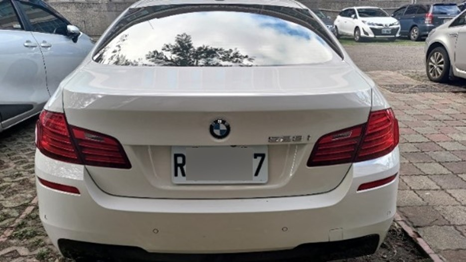
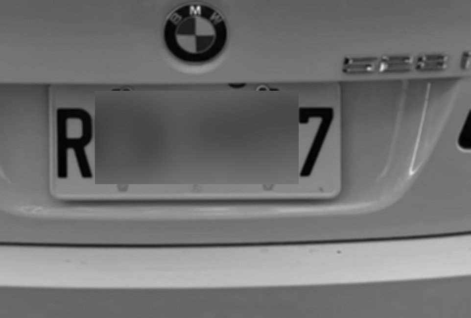
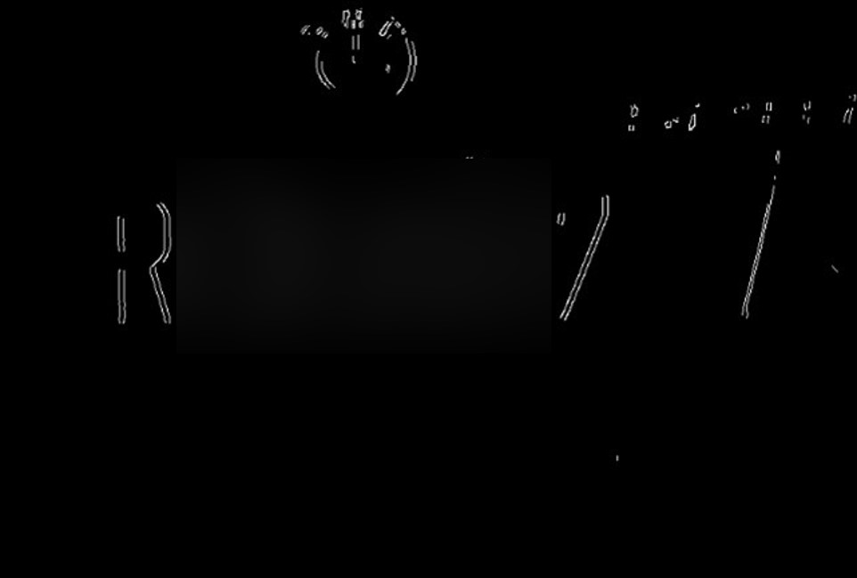
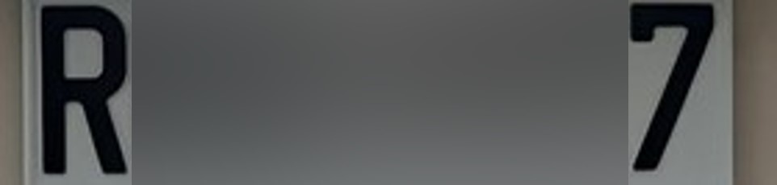
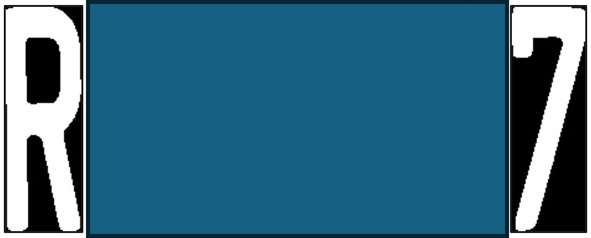

# Taiwan License Plate Recognition

A classic computer vision pipeline for recognizing Taiwan license plates (format: `AAA-1234`) using OpenCV — built without any deep learning, relying entirely on traditional image processing and template matching.

## Overview

This project implements a full end-to-end license plate recognition system from scratch. It detects a license plate region in an input image, isolates individual characters through morphological operations, and identifies each character by comparing it against a pre-built font template using pixel-level similarity matching.

**Format supported:** Taiwan standard plates — 3 uppercase letters followed by 4 digits (e.g., `ABC-1234`)

## Pipeline

```
Input Image
    │
    ▼
ROI Crop (center region)
    │
    ▼
Grayscale + Gaussian Blur
    │
    ▼
Sobel Edge Detection → Canny Edge Detection → Binary Threshold
    │
    ▼
Morphological Dilation/Erosion (plate region localization)
    │
    ▼
Contour Filtering (aspect ratio + size constraints)
    │
    ▼
Plate Normalization (resize to 550×200)
    │
    ▼
Black-Hat Transform (enhance character contrast)
    │
    ▼
Connected Component Labeling (character segmentation)
    │
    ▼
Template Matching (>99% pixel similarity threshold)
    │
    ▼
Output: "ABC-1234"
```

## Pipeline Visualization

<table>
  <tr>
    <td align="center"><b>① Original Input</b></td>
    <td align="center"><b>② Grayscale + Gaussian Blur</b></td>
    <td align="center"><b>③ Sobel Edge Detection</b></td>
    <td align="center"><b>④ Binary Threshold</b></td>
  </tr>
  <tr>
    <td></td>
    <td></td>
    <td></td>
    <td></td>
  </tr>
  <tr>
    <td align="center"><b>⑤ Morphological Dilation/Erosion</b></td>
    <td align="center"><b>⑥ Plate Crop</b></td>
    <td align="center"><b>⑦ Character Segmentation</b></td>
    <td></td>
  </tr>
  <tr>
    <td></td>
    <td></td>
    <td></td>
    <td></td>
  </tr>
</table>

## Requirements

- Python 3.7+
- OpenCV
- NumPy
- scikit-image

```bash
pip install -r requirements.txt
```

## Usage

```bash
python license_plate.py <path_to_image>
```

**Example:**

```bash
python license_plate.py car.jpg
# Output: ABC-1234
# Saved to: results/ABC-1234.jpg
```

> Make sure the `results/` output directory exists before running:
> ```bash
> mkdir results
> ```

## Project Structure

```
.
├── license_plate.py       # Main recognition script
├── template_fonts.bmp     # Character template image (36 templates: A–Z, 0–9)
├── results/               # Output directory for recognized plate images
├── requirements.txt
└── README.md
```

## Limitations

- Designed for **Taiwan standard license plates** (3-letter + 4-digit format)
- The plate must be **roughly centered** and **visible** in the input image
- Template matching requires high image quality; blurry or skewed plates may fail

